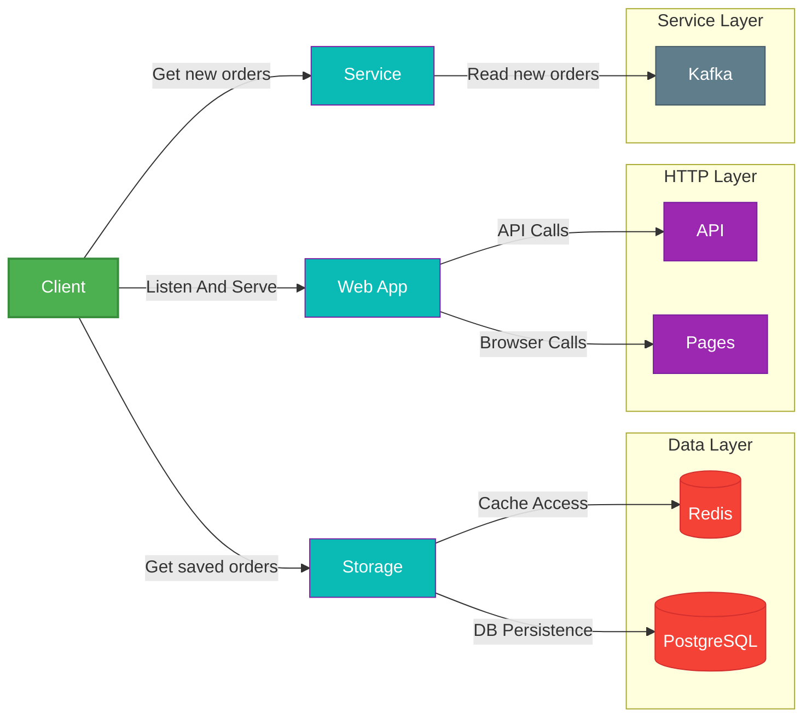
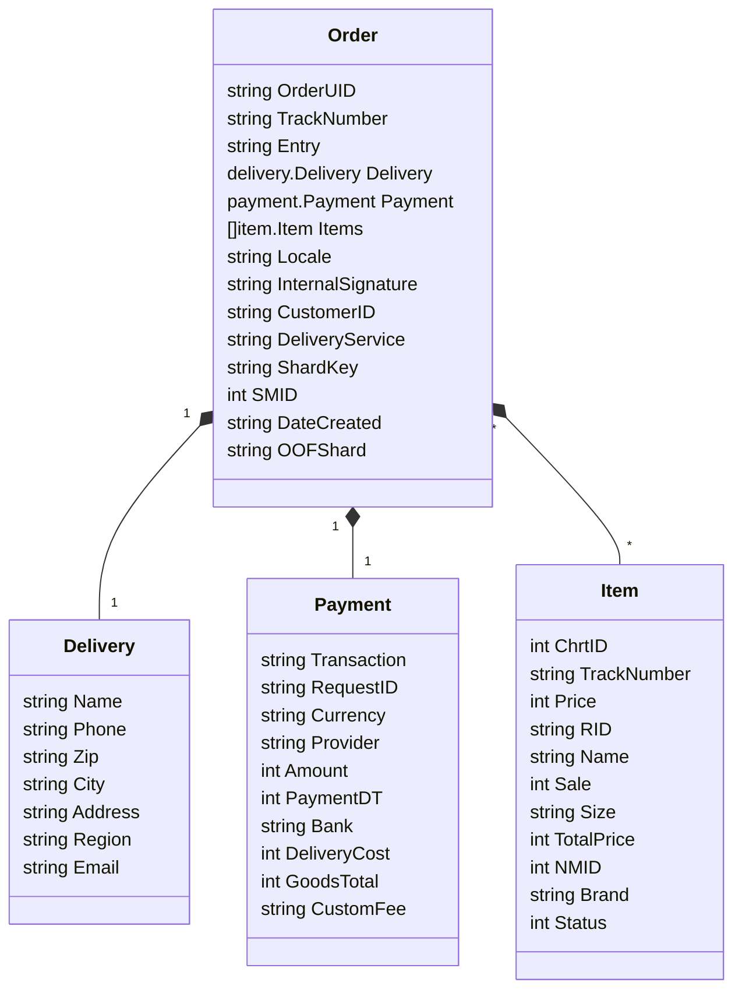
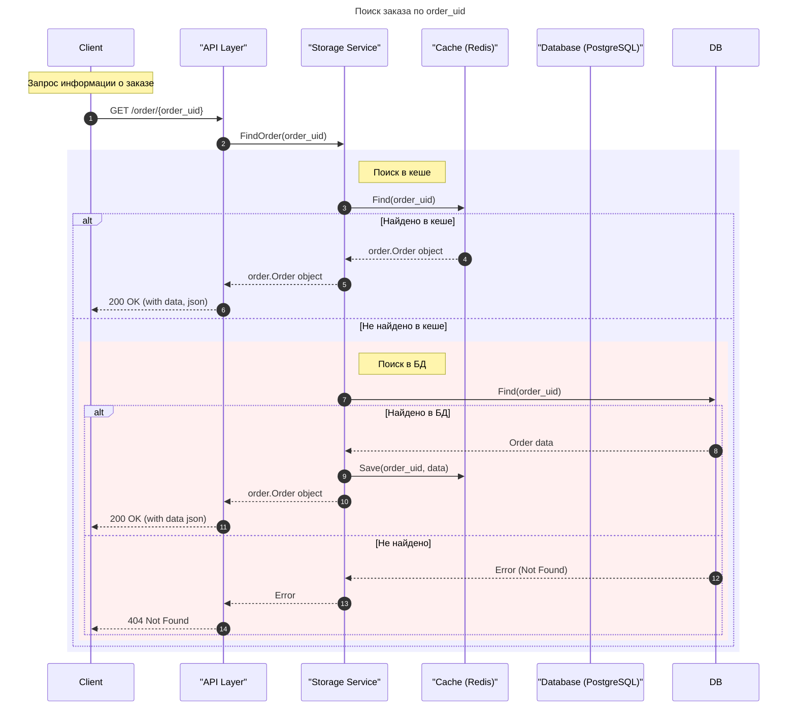
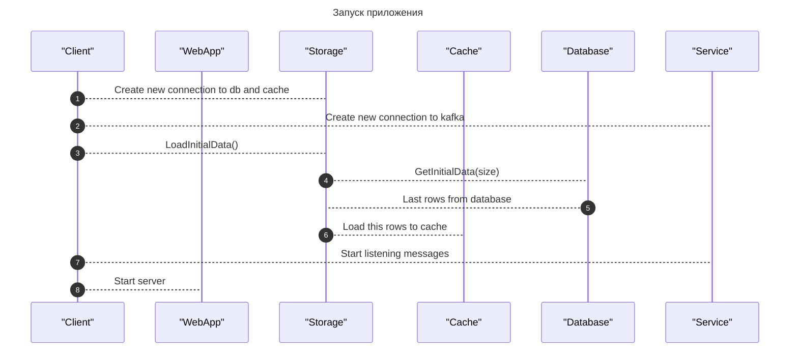

# VIDEO - https://drive.google.com/file/d/15RVY8UpEPOUJb8T6gIf0QGBVUsDSs8Yq/view?usp=sharing

# web-l0

Golang service with web-interface and API

## Architecture



## Data

### Models



### Api Request Order



## API Documentation (localhost:8080/swagger/index.html)

```
GET /order/{order_uid}

Get order by order_uid from storage
order_uid - required

Response:
200 - json (Order object)
400 - json (Error object)
404 - json (Error Object)
500 - json (Error Object)
```

## Startup

### Graphic



### Local

- docker-compose up

  ```
  postgres: localhost:5432 (user=dev, password=qqq, dbname=mydb) | load dump with test data
  pgadmin: localhost:8081 (admin@example.com:admin)
  kafka: localhost:9092 (topic=orders)
  redis: localhost:6379
  ```

- config loading
  You should use -c "..." with config file path, config file is .yml
```
type Config struct {

  WebConfig  `yaml:"web_config" env-required:"true"`

  PostgresConfig  `yaml:"postgres_config"`

  RedisConfig  `yaml:"redis"`

  KafkaOrdersConfig  `yaml:"kafka"`


  InitialDataSize  int  `yaml:"initial_data_size" env-default:"100"`

}


type WebConfig struct {

  Host  string  `yaml:"host" env-required:"true"`

  Port  string  `yaml:"port" env-required:"true"`

  ReadTimeout  time.Duration  `yaml:"read_timeout" env-default:"10s"`

  WriteTimeout  time.Duration  `yaml:"write_timeout" env-default:"10s"`

}


type PostgresConfig struct {

  Host  string  `yaml:"host" env-required:"true"`

  Port  string  `yaml:"port" env-required:"true"`

  User  string  `yaml:"user" env-required:"true"`

  Password  string  `yaml:"password" env-required:"true"`

  DBName  string  `yaml:"db_name" env-required:"true"`

  SSLMode  bool  `yaml:"sslmode" env-default:"false"`

}


type RedisConfig struct {

  Host  string  `yaml:"host" env-required:"true"`

  Port  string  `yaml:"port" env-required:"true"`

  Password  string  `yaml:"password"`

  DBName  int  `yaml:"db_name"`

}


type KafkaOrdersConfig struct {

  Brokers  []string  `yaml:"brokers" env-required:"true"`

  Topic  string  `yaml:"topic" env-required:"true"`

  MinBytes  int  `yaml:"min_bytes" env-default:"1"`

  MaxBytes  int  `yaml:"max_bytes" env-default:"10e6"`

}
```

# logs

Logs saved in ./log/app.log
